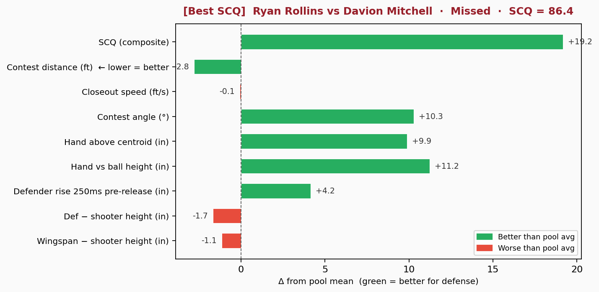
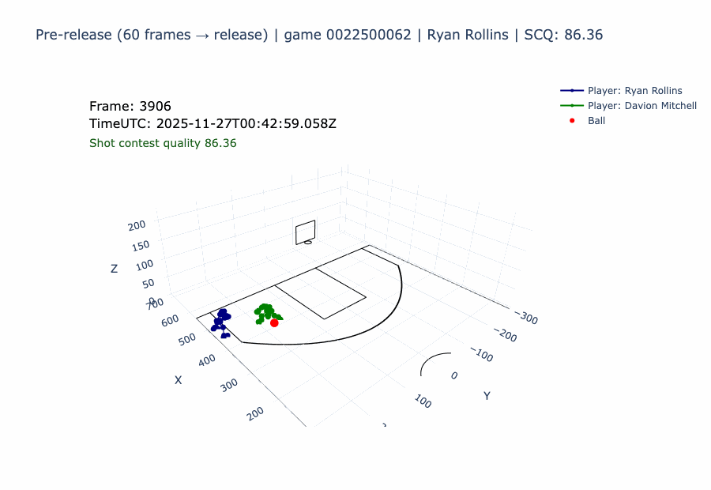
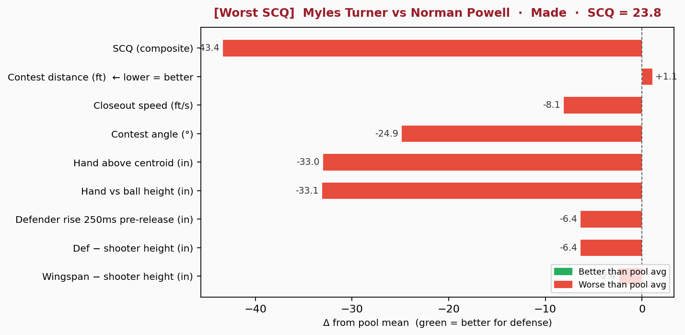
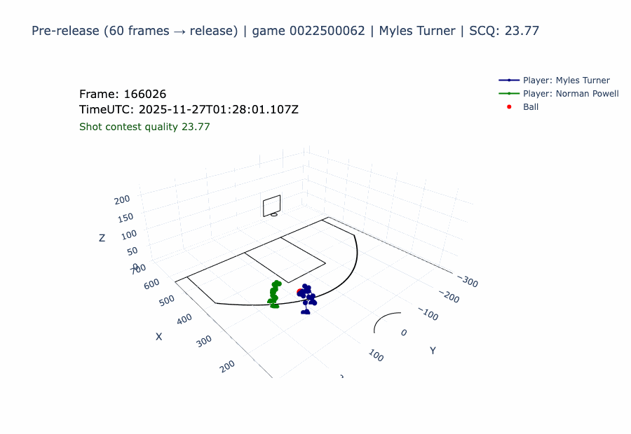

# Contesting the Three: A Hawk-Eye Analysis of Perimeter Defense

MIT 15.285 Sports Analytics · 2025–26 NBA Season

---

> *"One Heat defender allowed opponents to make only 20.8% of their three-point attempts, which is nearly 15 percentage points below league average. His box-score metrics ranked him last on his own team's perimeter defense leaderboard. However, the tracking data tells a different story."*

---

## What This Project Does

This project builds a full analytics pipeline on top of **Hawk-Eye optical tracking data** — the 60-frames-per-second positional system used by the NBA — to measure *how* Miami Heat defenders contest three-point shots, not just *that* they do.

The core problem: conventional metrics conflate **contesting a shot** with **defending a shot well**. A defender sprinting full-speed toward a shooter from 15 feet looks like effort. So does a defender pump-faked into the air while a shooter releases. Neither is good defense. Box scores and basic tracking stats can't separate them. Hawk-Eye can.

**15 games · ~1.1 GB of tracking data per game · 459 shots extracted · 310 actively contested**

---

## Three Findings Worth Knowing

### 1. Tracking puts numbers on what film can only show

Film tells you *that* a defender was there. Hawk-Eye tells you exactly how far they were at the release frame (to the tenth of a foot), how fast they arrived, what angle they came from relative to the rim, and how high their hand was above the ball at the exact moment the shot left the shooter's fingertips. Those are four separate, measurable levers — and for the first time, they can each be benchmarked, compared across a roster, and coached in specific terms.

Consider Bam Adebayo. On film and in the box score, his perimeter defense reads as passive: low closeout speed, rarely the defender making a dramatic last-second sprint. Tracking tells a different story. At the release frame, his hand is 44.6 inches above his body centroid — one of the highest elevations recorded on the team. His approach angle puts him between the shooter and the rim, not scrambling from the side. His distance at release is elite. The film doesn't easily reveal any of this. The data does.

That's the core value of this pipeline: it translates defensive instinct into a fingerprint — one that can be compared across defenders, tracked over a season, and used as the basis for targeted skill development.

### 2. Low closeout speed is the wrong red flag — and Bam proves it

Closeout speed is the most visible kinematic signal in film review. A defender sprinting full-speed reads as effort; one who isn't sprinting reads as passive. That visual shortcut is misleading, and Bam Adebayo is the clearest illustration of why.

Bam has the **lowest average closeout speed** on the Heat's perimeter defense roster. He also allowed opponents to make only **20.8% of their three-point attempts** against his contests — a lift of −20.5 percentage points below what shooter quality and shot difficulty predicted. Best suppression number on the team by a wide margin.

Tracking resolves the apparent contradiction. Bam's low speed is a signal of *positioning*, not passivity: he was already in range before the shot was set, so he didn't need to sprint. The measurement that matters isn't how fast he got there — it's where he was at the moment of release. His hand elevation and physical reach advantage over shooters are among the highest on the roster. The physical model confirms it: height differential and hand elevation at release are the two strongest predictors of shot suppression in the sample.

Closeout speed, by contrast, is statistically indistinguishable from noise in the outcome model once position and physical features are controlled for.

### 3. Component-level measurement makes defense teachable

Before tracking, perimeter defense feedback was categorical: you were there or you weren't. What component measurement enables is feedback on four distinct levers — each independently measurable, each independently coachable:

- **Distance at release** — how close the defender was when the ball left the shooter's hand, regardless of how they got there
- **Closeout speed** — how urgently they closed from their starting position
- **Approach angle** — whether they arrived between the shooter and the rim or from the side
- **Hand elevation above the ball** — the physical disruption of the shooting lane at the moment of release

Because each of these is now a number, coaching becomes specific. Instead of "contest harder," a coach can say: "your approach angle on drive-and-kick situations is 23° off-center — fourth-worst on the roster" or "your hand is 8 inches below the pool average at release." That specificity is what separates a general correction from a repeatable skill adjustment.

It also separates defenders into honest archetypes. A closer who arrives fast from distance is executing a fundamentally different strategy than a positioned defender who was already there — both can be effective, and both can be coached on the specific dimension where they lose ground. A sensitivity analysis across five SCQ weighting schemes makes this split visible: the Spearman correlation between speed-heavy and technique-heavy rankings is **−0.46**, meaning the roster essentially sorts into two non-overlapping defensive profiles depending on which dimension you prioritize. That's not a flaw in the metric — it's the data revealing that perimeter defense isn't one skill.

---

## Methods

### Active Contest Definition

Not every nearby defender is contesting a shot. Two filters applied at the release frame — the exact moment the ball leaves the shooter's hand:

- **Distance ≤ 8 ft** — beyond this threshold, shot mechanics research suggests minimal disruption
- **Angle ≥ 90°** — the angle between the defender-to-shooter vector and the shooter-to-rim vector; values below 90° mean the defender is behind the shooter, not between them and the basket

This excluded ~4% of apparent contests from behind and the long-distance near-misses that inflate raw contest-rate stats. Both filters are baked into `analysis_eligible` in the dataset.

### Shot Contest Quality (SCQ)

A 0–100 composite score computed at the release frame from four normalized dimensions:

| Component | Weight | Normalization |
|-----------|--------|--------------|
| Defender distance to shooter | 35% | `max(0, 1 − dist / 10 ft)` |
| Closeout speed | 30% | `clip(speed / 8 ft·s⁻¹, 0, 1)` |
| Contest angle | 20% | `clip((angle − 90°) / 90°, 0, 1)` |
| Hand height above ball | 15% | `clip(hand_in / 18 in, 0, 1)` |

The angle formula was corrected from an inverted version (`1 − angle/90°`) that accidentally rewarded defenders behind the shooter and zeroed out the angle component for all eligible shots. The corrected formula maps 90° → 0 and 180° → full credit, rewarding defenders who stand directly between shooter and rim.

### Lift vs. Baseline Framework

Raw make rate is a noisy defensive outcome — it conflates shooter quality, shot difficulty, and defensive contribution. To isolate the defensive signal:

1. Train a **ridge logistic regression** on shooter-only features: season 3P%, distance to rim, release height, arc (apex height), and shot clock remaining
2. Compute expected make probability for each shot *without* any defensive information
3. **Lift = actual make rate − expected make rate** per defender

Negative lift = genuine suppression below what shooter quality and shot type predict. This absorbs assignment difficulty rather than penalizing defenders for guarding better players.

Ridge logistic regression implemented from scratch in pure Python with gradient descent and L2 regularization (λ = 0.1). Defender-level intercepts estimated via Bayesian shrinkage toward the pool mean. Full model (contest + physical features) improved Brier score from 0.243 to 0.233.

### Physical Feature Engineering from Hawk-Eye

| Feature | How Computed |
|---------|-------------|
| `effective_contest_height_in` | `max(lWrist_z, rWrist_z) − ball_z` at the release frame |
| `defender_jump_in` | Vertical centroid displacement over the 250ms window ending at release |
| `height_diff_in` | Defender height − shooter height (NBA combine data, 1,835 players) |
| `wingspan_vs_shooter_height_in` | Defender wingspan − shooter height |

The defender jump feature captures a pump-fake artifact: positive values indicate the defender left the floor before release, often in response to a shot fake.

---
## Metric Alignment: Do the Numbers Match What We See?

The two shots below anchor either end of the SCQ distribution — the single best and worst contest in the 310-shot eligible pool. Each bar chart shows how that shot's contest metrics compare to the pool average (green = better for defense, red = worse). The GIF shows the 3D player/ball positions in the ~1 second before release.

### Best SCQ — Davion Mitchell on Ryan Rollins (SCQ 86.4 · Missed)

Mitchell was 3.0 ft from Rollins at release — 2.8 ft closer than the pool average — directly in front (+10.3° above average angle), with his hand 11.2 inches higher above the ball than a typical contest. The shot missed. The height and wingspan numbers are slightly red because Rollins is taller, but every positioning and technique metric is green.





---

### Worst SCQ — Norman Powell on Myles Turner (SCQ 23.8 · Made)

Powell is nearly 7 ft away (1.1 ft beyond pool average), moving at 0.4 ft/s (8.1 ft/s below average — essentially stationary), with his hand 33 inches *below* the ball at release. Turner's angle advantage (−24.9°) confirms defensive displacement. Every metric is red. The shot went in.





---

## Results

### Per-Defender SCQ Rankings

SCQ measures **contest process** — how urgently and correctly a defender executed the closeout. It is a diagnostic tool for coaching, not a ranking of defensive outcomes. A stationed defender like Adebayo will always score lower on the speed component than a scrambling closer, because he arrived in position before the play developed and didn't need to sprint. Read the SCQ columns as "what did this defender's technique look like at release?" and the lift column as "what did it produce?"

| # | Defender | Shots | SCQ | Speed | Angle | Hand | Lift vs. Baseline |
|---|----------|-------|-----|-------|-------|------|-------------------|
| 1 | Dru Smith | 16 | 71.1 | **28.9 ↑** | 11.2 ↓ | 14.9 | +6.9 pp |
| 2 | Kasparas Jakucionis | 13 | 69.6 | 26.5 ↑ | 13.1 | 14.6 | −10.0 pp ✓ |
| 3 | Davion Mitchell | 48 | 69.5 | 25.3 ↑ | 14.3 | 13.9 | +7.0 pp |
| 4 | Tyler Herro | 32 | 68.8 | 25.7 ↑ | 13.7 | 13.3 | −11.4 pp ✓ |
| 4 | Kel'el Ware | 10 | 68.8 | 24.1 | **16.3 ↑** | **15.0 ↑** | −5.6 pp ✓ |
| 6 | Jaime Jaquez Jr. | 40 | 67.1 | 23.6 | 14.2 | 14.5 | +11.9 pp |
| 7 | Pelle Larsson | 39 | 67.0 | 23.7 | 14.1 | 14.1 | +8.0 pp |
| 8 | Simone Fontecchio | 10 | 66.8 | 27.6 ↑ | 12.4 ↓ | 14.4 | +1.3 pp |
| 9 | Norman Powell | 15 | 66.0 | 22.4 | 15.2 ↑ | 14.2 | −6.9 pp ✓ |
| 10 | Nikola Jovic | 10 | 65.1 | 21.5 | 14.3 | **15.0 ↑** | −18.1 pp ✓ |
| 11 | Andrew Wiggins | 52 | 64.6 | 20.5 ↓ | **16.1 ↑** | 14.6 | +2.1 pp |
| 12 | Bam Adebayo | 25 | **62.3 ↓** | 17.6 ↓ | 15.6 ↑ | **15.0 ↑** | **−20.5 pp ✓** |

*Pool average SCQ ≈ 67. Component scores are weighted normalized values summing to SCQ. ↑ above pool mean; ↓ below. ✓ = genuine suppression signal.*

### Physical Model: Feature Coefficients

| Feature | Odds Ratio per +1 SD | Interpretation |
|---------|---------------------|----------------|
| Effective contest height | **0.882** | Strongest predictor — hand above ball suppresses makes |
| Height difference (def − shooter) | **0.885** | Raw height advantage nearly as powerful |
| Wingspan vs. shooter height | 0.908 | Reach advantage independent of own height |
| SCQ composite | 0.912 | Combined contest quality |
| Defender jump (250ms pre-release) | **1.138 ↑** | Leaving the floor → more makes (pump-fake cost) |

### SCQ Sensitivity to Weighting

| Scheme | dist | speed | angle | hand | Spearman ρ vs. Original |
|--------|------|-------|-------|------|------------------------|
| Original | 0.35 | 0.30 | 0.20 | 0.15 | 1.000 |
| Equal weights | 0.25 | 0.25 | 0.25 | 0.25 | +0.916 |
| Distance-heavy | 0.55 | 0.20 | 0.15 | 0.10 | +0.937 |
| Technique-heavy (angle + hand) | 0.20 | 0.15 | 0.35 | 0.30 | **−0.126** |
| No speed / stationed focus | 0.45 | 0.00 | 0.30 | 0.25 | **−0.462** |

Rankings are stable when speed is included. When angle and hand are prioritized, they invert — revealing two fundamentally distinct defensive profiles on the roster.

---

## Repository Layout

```
├── scripts/
│   ├── pipeline/
│   │   ├── build_unified_shot_dataset.py       # Core pipeline: parquet → shot CSV
│   │   ├── opponent_three_pointers.py          # Release detection
│   │   └── hawkeye_extract_opponent_3pa.py
│   ├── analysis/
│   │   ├── model_defensive_effectiveness.py    # Ridge logit baseline + full physical model
│   │   ├── explain_scq_drivers_by_defender.py  # Per-defender SCQ component breakdown
│   │   ├── scq_weight_sensitivity.py           # 5-scheme Spearman sensitivity
│   │   ├── scq_lift_correlation.py             # SCQ ↔ lift correlation at shot and defender level
│   │   └── visualize_defensive_effectiveness.py
│   └── visualization/
│       ├── shot_viz_from_dataset.py            # 3D trajectory rendering from tracking
│       ├── viz.py
│       └── plot_release_snapshot_3d.py
├── notebooks/
│   ├── shot_viz_contest_extremes/
│   │   ├── shot_viz_best_worst.ipynb           # Interactive best/worst shot explorer
│   │   └── metric_alignment_viz.ipynb          # SCQ component vs. visual ground-truth
│   └── shot_viz_from_dataset.ipynb
├── data/
│   ├── intermediate/
│   │   └── shot_contest_dataset.csv            # 459 rows · 46 columns (tracked in repo)
│   └── player_height_wingspan.csv              # NBA combine measurements, 1,835 players
├── report/
│   └── heat_perimeter_defense_report.md        # Full technical report
└── requirements.txt
```

---

## Setup & Run

```bash
git clone https://github.com/<you>/15.285-ContestedProject
cd 15.285-ContestedProject
python -m venv .venv && source .venv/bin/activate
pip install -r requirements.txt
```

**Rebuild the shot dataset** (requires Hawk-Eye `.parquet` files):
```bash
python scripts/pipeline/build_unified_shot_dataset.py \
  --input-dir /path/to/processed_parquets \
  --player-measurements-csv data/player_height_wingspan.csv \
  --pbp-cache-csv data/intermediate/shot_contest_dataset.csv \
  --output-csv data/intermediate/shot_contest_dataset.csv
```

**Run all analysis** (works from the tracked CSV — no parquet files required):
```bash
python scripts/analysis/model_defensive_effectiveness.py \
  --csv data/intermediate/shot_contest_dataset.csv --out-dir data/outputs

python scripts/analysis/explain_scq_drivers_by_defender.py \
  --csv data/intermediate/shot_contest_dataset.csv --out-dir data/outputs

python scripts/analysis/scq_weight_sensitivity.py \
  --csv data/intermediate/shot_contest_dataset.csv --out-dir data/outputs

python scripts/analysis/scq_lift_correlation.py
```

> The compiled `shot_contest_dataset.csv` is tracked in the repo so analysis scripts can run without the raw Hawk-Eye files. Parquet files (~1.1 GB each) are not vendored.

---

## Technical Implementation Notes

**PBP alignment.** Shot detections are matched to NBA CDN play-by-play on shooter ID, period, and game clock. A rescue pass with relaxed thresholds recovers flat-arc and partial-track releases. After the 2025–26 season ended, the CDN returned 403s; the pipeline falls back to an offline PBP cache keyed on `(game_id, release_frame)`.

**Eligibility flags.** `analysis_eligible` is the primary analysis gate. Structured exclusion codes: `defender_too_far` (> 8 ft), `defender_behind` (angle < 90°), `heave`, `desperation_shot`, PBP mismatch. `defender_model_eligible` further requires all numeric model inputs to be finite with a valid shooter prior.

**Ridge regression from scratch.** Gradient descent with L2 regularization; no scikit-learn dependency. Allows full transparency into coefficient estimation and easy modification of the regularization path.

---

## About

Developed for **MIT 15.285 (Sports Analytics)** using Hawk-Eye data provided through the course. Built as a demonstration of applied sports analytics: constructing production-grade pipelines on raw tracking data, asking basketball-first questions about what the data can actually answer, and communicating findings to both technical and non-technical audiences.
